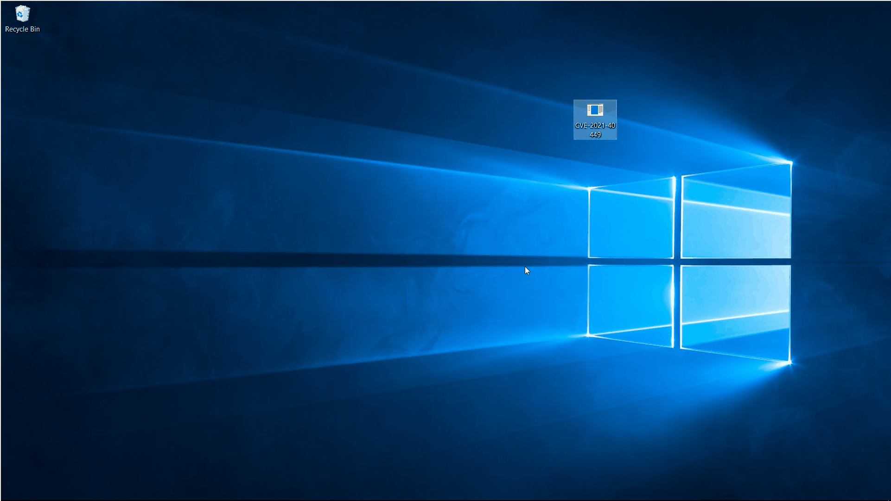

# CVE-2021-40449
My exploit for CVE-2021-40449, a Windows LPE via a UAF in win32kfull!GreResetDCInternal.
# short wu
along with the UAF vulnerabilty other primitives are being used to make this exploit possible:  
- leaking the exploit's `access token` address in ring0 via `NtQuerySystemInformation()` function with the `SystemHandleInformation` parameter.  
- using `rtlSetAllBits()` as a gadget to overwrite the exploit's `access_token.privileges` with `0xFF`s.  
- leaking `rtlSetAllBits()` address on ring0 by leaking the base address of `ntoskrnl.exe` module via `EnumDeviceDrivers()` function.  
- crafting the gadget's parameter  `BitMapHeader` in such a way that will allow us to overwrite the `access_token.privileges` of the exploit.  
- allocating the crafted `BitMapHeader` via `NtSetInformationThread()` primitive and leaking the allocation address in the big pool via `NtQuerySystemInformation()` function with `SystemBigPoolInformation` parameter.  
- to interact with the vulnerable function we first enum printers on the system via `EnumPrinters()` load one of them then hook the calls to the usermode callback function `DrvEnablePDEV()` while proxying the other calls to the driver.  
- triggering the UAF via a second call to `ResetDC()` in the hooked `DrvEnablePDEV()`.  
- reclaim the freed `PDC` object via spraying a crafted object of the same size using the `CreatePalette()` primitive.  
- abusing the new aquired `SeDebugPrivilege` privilege to get `NT AUTHORITY\SYSTEM` via injecting shellcode to `winlogon.exe` process.  
          
More information can be found on this [article](https://securelist.com/mysterysnail-attacks-with-windows-zero-day/) by Kaspersky.  
# PoC

tested on Win10 Redstone (build 14393). 
